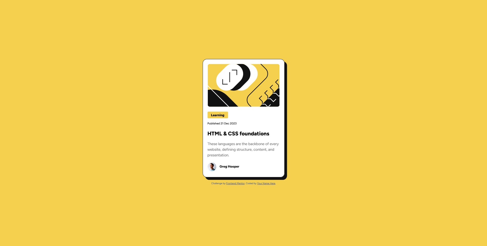
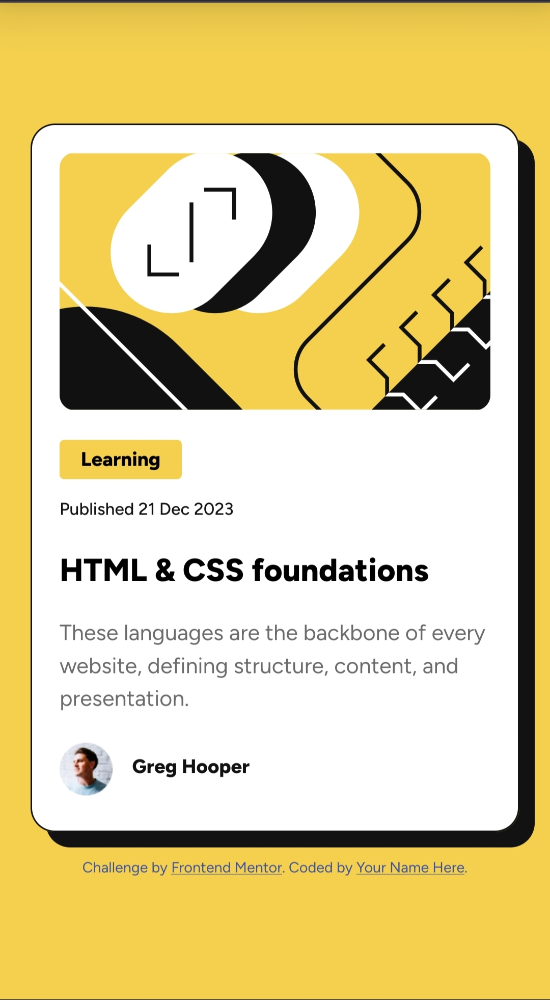

# Frontend Mentor - Blog preview card solution

This is a solution to the [Blog preview card challenge on Frontend Mentor](https://www.frontendmentor.io/challenges/blog-preview-card-ckPaj01IcS). Frontend Mentor challenges help you improve your coding skills by building realistic projects. 

## Table of contents

- [Overview](#overview)
  - [The challenge](#the-challenge)
  - [Screenshot](#screenshot)
  - [Links](#links)
- [My process](#my-process)
  - [Built with](#built-with)
  - [What I learned](#what-i-learned)
  - [Continued development](#continued-development)
  - [Useful resources](#useful-resources)
- [Author](#author)
- [Acknowledgments](#acknowledgments)

## Overview

### The challenge

Users should be able to:

- See hover and focus states for all interactive elements on the page

### Screenshot

### Links

- Solution URL: [https://github.com/medievalnudistofthedead/blog-preview-card](https://github.com/medievalnudistofthedead/blog-preview-card)
- Live Site URL: [https://medievalnudistofthedead.github.io/blog-preview-card/](https://medievalnudistofthedead.github.io/blog-preview-card/)

## My process

### Built with

- Semantic HTML5 markup
- Flexbox
- Mobile-first workflow

### What I learned

Using what I learned from the last project I was able to utilize flex without any real issue.

### Continued development

I'm still manually having to tweak padding and margins for small things and I don't know yet if that's just how it is or if that's something that will improve as I learn more.

### Useful resources

- [freeCodeCamp](https://www.freecodecamp.org/learn/)

## Author

Medi

## Acknowledgments

Islandstone89 who helped me with the last solution, for which I now have a greater understanding of how flexbox works.